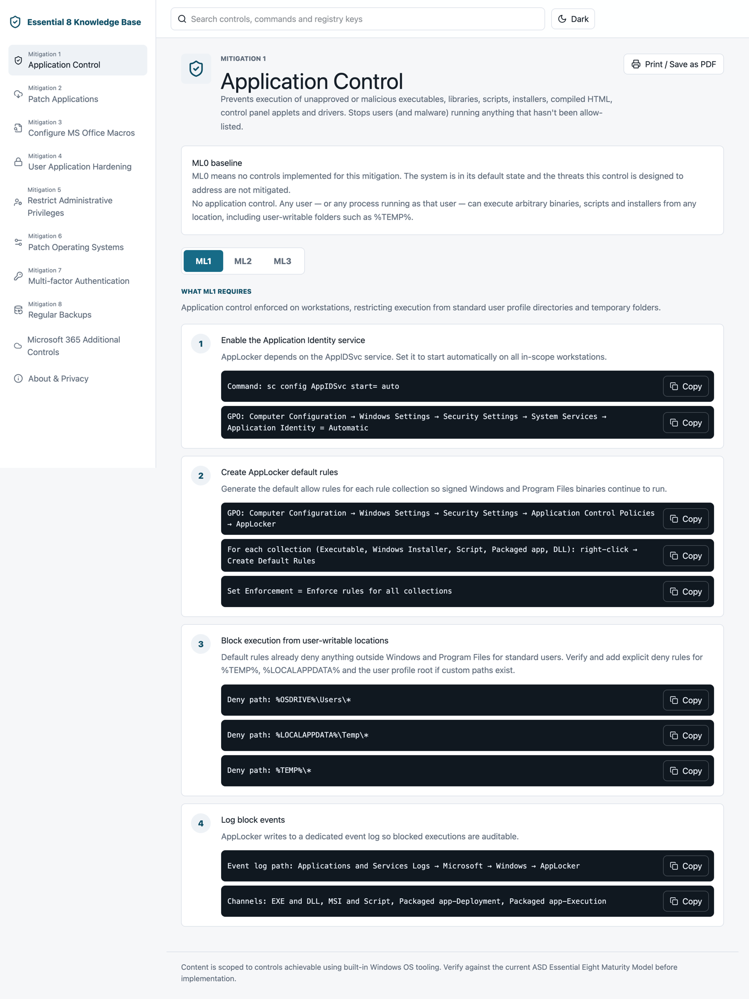
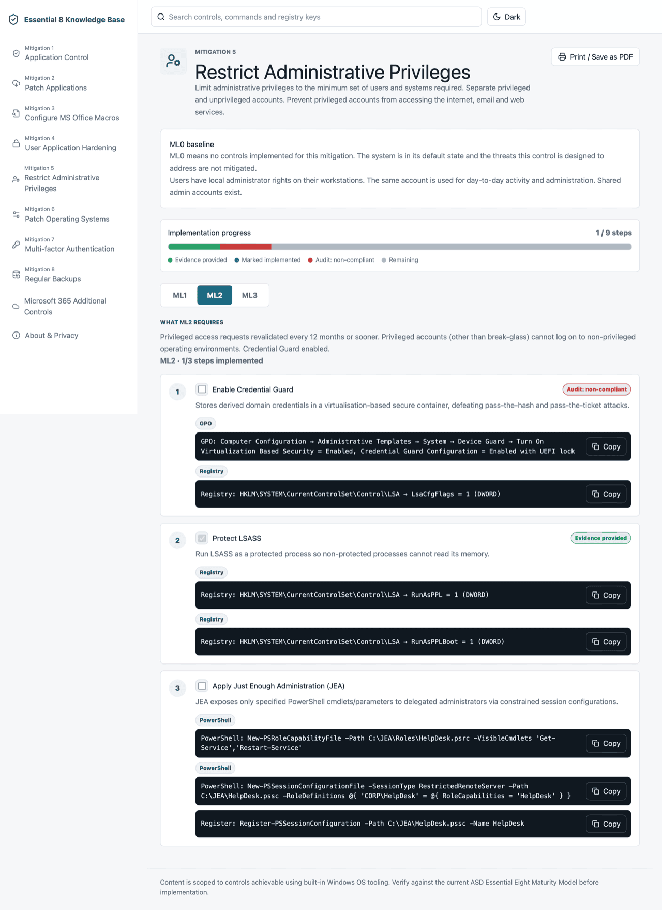

# Essential 8 Knowledge Base — Web

[](https://github.com/MaddogWarner/E8-Knowledgebase-Web/actions/workflows/build-container.yml)
[](https://github.com/MaddogWarner/E8-Knowledgebase-Web/releases)
[](https://github.com/MaddogWarner/E8-Knowledgebase-Web/pkgs/container/e8-knowledgebase-web)
[](LICENSE)

A **self-hostable, offline web version** of the
[Essential 8 Knowledge Base iOS app](https://maddogwarner.com) by **MadDogWarner** —
a quick technical reference for system administrators implementing the **ASD
Essential Eight** using built-in Windows OS tooling. It ships as a single hardened
Docker container so a team can stand it up internally (a NOC screen, an internal
server) instead of reaching for a phone.

## Purpose

Pick one of the eight mitigations, choose a Maturity Level (ML1, ML2 or ML3), and
read the specific configuration changes — Group Policy paths, registry keys,
PowerShell, `wbadmin`, `icacls`, `vssadmin` — required to meet that level. A quick
reference for use next to a console, not a learning resource.

The optional **M365 Additional Controls** page lets you select a Microsoft 365
licensing mode so maturity-level pages show separate Microsoft 365 / Microsoft
Defender additions without mixing them into the built-in Windows guidance.

The web app can also act as a lightweight implementation tracker. Manual step
statuses are stored only in the browser, and CSV evidence from the
`e8-hardening-audit-policy-compliance-checker` is held in memory for the current
session only.

## Scope

- Covers the **November 2023** release of the ASD Essential Eight Maturity Model.
- Documents only configuration achievable with **built-in Windows OS tooling** (Group Policy, registry, AppLocker / WDAC, Microsoft Defender / ASR, Windows Update for Business, Windows LAPS, Windows Hello for Business, Windows Server Backup, ReFS, Credential Guard, etc.).
- Where a level needs capability beyond Windows built-ins, the gap is called out under **"Beyond Windows built-in tooling"**.
- M365 additions are hidden by default; when enabled they show as additional/partial supports for **E3 + Entra ID P1**, **E3 + Entra ID P2**, or **E5**.
- Always verify against the current ASD Maturity Model before implementing.

## Mitigations covered

1. Application Control · 2. Patch Applications · 3. Configure Microsoft Office
Macros · 4. User Application Hardening · 5. Restrict Administrative Privileges ·
6. Patch Operating Systems · 7. Multi-factor Authentication · 8. Regular Backups

Each control also surfaces an **ML0** baseline ("no controls implemented").

## Features

- Desktop-first layout: sidebar of all eight mitigations + Windows Audit Policy + M365 + About, with a wide content pane (responsive to mobile).
- Per-control overview, ML0 baseline, and ML1/ML2/ML3 maturity tabs with numbered, copy-able command / GPO / registry blocks.
- Per-step implementation status: Not Implemented, Implemented or Not Applicable with an optional local reason.
- Compliance dashboard with a target-scoped progress ring and per-mitigation stacked bars.
- **Global search** across every control, step, ISM control ID, technical detail and Windows Audit Policy entry.
- **Deep-link URLs** per control and maturity level (e.g. `/control/3/ml2`) for bookmarking and sharing.
- **Print / Save as PDF** for clean runbook output.
- **Dark mode** toggle (remembered locally).
- ISM control capsules on mapped implementation steps.
- Windows Audit Policy reference page with grouped recommendations.
- Exportable compliance report as CSV, plus printable report output.
- Environment profiles for separate systems or teams; progress, target maturity, hide-completed and M365 licence mode are isolated per profile.
- Client-side CSV evidence upload for the E8 hardening audit and policy
  compliance checker. Only cleanly mapped E8 rows are used; MDE and audit-policy
  rows are ignored, and host/user/IP/raw CSV data is not persisted.
- Home-page target maturity selector with an option to hide mitigations already
  complete for the selected target.
- No accounts, no analytics, no data collection — entirely client-side and offline.

## Screenshots

| Home — overview, progress & CSV evidence upload | Control detail — progress bar, step ticks & type chips |
| --- | --- |
|  |  |

| CSV audit evidence mapped to steps | Maturity level with Microsoft 365 additions |
| --- | --- |
|  |  |

| Global search | Microsoft 365 licensing modes |
| --- | --- |
|  |  |

| Dark mode |
| --- |
|  |

## Architecture

A single hardened container: a React + TypeScript + Vite SPA built and served by
nginx, which terminates TLS, redirects HTTP→HTTPS, and sets a strict
Content-Security-Policy and other security headers. There is **no backend and no
database** — all content is static, and the only stored state (theme, profile
names, target maturity, hide-complete preference, M365 licensing mode and manual
step statuses / N/A reasons) lives in the browser's `localStorage`. CSV-derived
evidence remains in memory only and clears on refresh or profile switch.

```text
[ browser ] ──HTTPS──▶ [ nginx (TLS + security headers) ] ──▶ static SPA (dist/)
```

## Deploy

Requires Docker + Docker Compose.

### Option A — run the published image (GHCR)

```bash
docker run -d --name e8-kb \
  -p 80:80 -p 443:443 \
  -v "$PWD/certs:/etc/nginx/certs" \
  ghcr.io/maddogwarner/e8-knowledgebase-web:latest
```

### Option B — build from source with Compose

```bash
git clone https://github.com/MaddogWarner/E8-Knowledgebase-Web.git
cd E8-Knowledgebase-Web
cp .env.example .env          # optional: set HTTP_PORT / HTTPS_PORT
docker compose up --build -d
```

Browse to `https://localhost` (or the host's address). On first run nginx
generates a **self-signed certificate**, so your browser will warn once — expected
for an internal tool.

### Use your own certificate

Drop a `server.crt` and `server.key` into `./certs/` and restart:

```bash
cp your-cert.crt certs/server.crt
cp your-cert.key certs/server.key
docker compose restart web   # or: docker restart e8-kb
```

### Access control

The app ships with **no built-in authentication** — the Essential Eight is public
reference material. For internal deployments, place it behind your existing
network controls (VPN, SSO reverse proxy, IP allow-listing) as needed.

## Develop

```bash
cd services/web
npm install
npm run dev          # http://localhost:5173
npm run test         # unit tests (Vitest)
npm run test:e2e     # end-to-end tests (Playwright)
npm run build        # production build → dist/
npm run lint
npm run typecheck
```

### Regenerate Swift-derived data

The TypeScript data modules under `services/web/src/data/` are generated verbatim
from the original iOS Swift source. Point the generator at a local checkout of the
iOS project:

```bash
node scripts/generate-data.mjs --swift-root="/path/to/Essential 8 Knowledge Base"
```

Alternatively set the `E8KB_SWIFT_SOURCE` environment variable to the Swift source
directory.

### Regenerate screenshots

With the app running locally:

```bash
cd services/web
BASE_URL=http://localhost:5173 node scripts/capture-screenshots.mjs
```

## Privacy

This tool does not collect, record, store, transmit or share any user data, and
makes no external network calls. The licensing-mode, theme, target maturity,
hide-complete preference, profile names and manual implementation statuses are
kept only in your browser. CSV audit evidence is parsed locally, mapped to the
small set of KB steps it cleanly covers, and cleared when the page is refreshed
or the active profile changes. Exported reports contain KB content, profile name,
target maturity, step status, local N/A reason and evidence outcome only; they do
not include hostnames, IP addresses, usernames or raw audit rows.

## Contributors

- **MadDogWarner** — creator and maintainer; author of the original Essential 8 Knowledge Base iOS app this is ported from. [maddogwarner.com](https://maddogwarner.com) · [GitHub](https://github.com/MaddogWarner)
- **Claude** (Anthropic) — plan, architecture, content-parity and security review.
- **Codex** — implementation (SPA, Docker, nginx, tests).

## Disclaimer

The content is a **reference**, not authoritative guidance. Changes — particularly
to AppLocker / WDAC, Credential Guard, ASR rules and `SmartcardLogonRequired` — can
lock users out or break business-critical software. Test in a representative
non-production environment first, and validate against the current ASD Essential
Eight Maturity Model and Microsoft documentation before applying in production.

## Licence

MIT — see [LICENSE](LICENSE).
